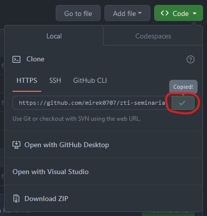

## Advanced Internet Technologies Seminar - WebSockets in JakartaEE

This a simple example application presenting WebSocket protocol in JakartaEE technology.

Server: TomEE 10.0.27 instance in JakartaEE

Client: simple Javascript WebSocket client

<h3>Step-by-step setup</h3>

#### Download TomEE server

The best source is probably
[the official Apache site](https://www.apache.org/dyn/closer.cgi/tomee/tomee-9.0.0/apache-tomee-9.0.0-plume.zip).

Click the link as shown on the picture below:

Place the downloaded archive in easily accessible place and extract the contents. The location of
this directory will be needed later on.

#### Setup IntelliJ IDEA Ultimate Edition

Head to [the JetBrains download site](https://www.jetbrains.com/idea/download/).

It is very important to **download the Ultimate Edition** as the standard Community Edition does not
provide support for JakartaEE and JavaEE technologies. We can appreciate the 30-day trial of fully
featured IDE. Students can acquire a special license for educational use, which removes the time
limit.

#### Download the project

Probably the simplest way to import this project into IntelliJ is to use the built-in feature, which
downloads all files from the remote repository:

Copy the repository URL:

...and paste it into the URL field:

Then click `Clone` button.

#### Download Java SDK 17

The last needed dependency is Java JDK 17, which is required to launch the application in the first
place.

Once again IntelliJ lets us do that automatically, go to `File > Project Structure`. Click `Project`
on the left-hand panel, press the `SDK` dropdown and then `Add SDK > Download SDK` if `17` is not
listed as an available option. The best choice would be `Eclipse Temurin (AdoptOpenJDK HotSpot)`.

In the `Project Structure` window click `Apply` and then `OK`. IDE should now download the SDK
in the background.

This is not the end of the project setup, though. The downloaded SDK now must be set in project
launch configuration.

#### Set TomEE and Java SDK in project configuration

Locate the project configuration dropdown near the top of the window (it should say `Current File`
if TomEE server was not used before) and click `Edit Configurations...`.

A new window should appear. If there are no configurations listed on the left, click `Add new...`
and select `TomEE Server > Local`.

The window should fill in with new options. There are two important fields to set up.

The first is `Application server`. Press `Configure...` button. If the list in the new window is
empty, press the plus icon and provide the directory path of the extracted TomEE server that was
downloaded earlier.

`TomEE Version` should show a `10.0.27` version of the server (if it does not, ensure the correct
path has been provided). Press `OK` to close both windows and return to project configuration view.

In the `JRE` dropdown select the installed Java JDK 17.

The final outcome should look like this:

Validate that everything is set up correctly by checking the `URL` field and `Before launch` section
below, which should list a `Build ...:war exploded artifact`. Press `Apply` and `OK`.

#### Launch the server

Finally, click the green "play" button next to the configuration dropdown. It is possible that after
the successful launch, some browser might open on the site with working WebSocket client.

### Barebone WebSocket Javascript client

Enter a nick, press `Connect` and chat with other users!

### License

This seminar is licensed under MIT, a free and open-source license. For more information, please see
[the license file](LICENSE.md).
